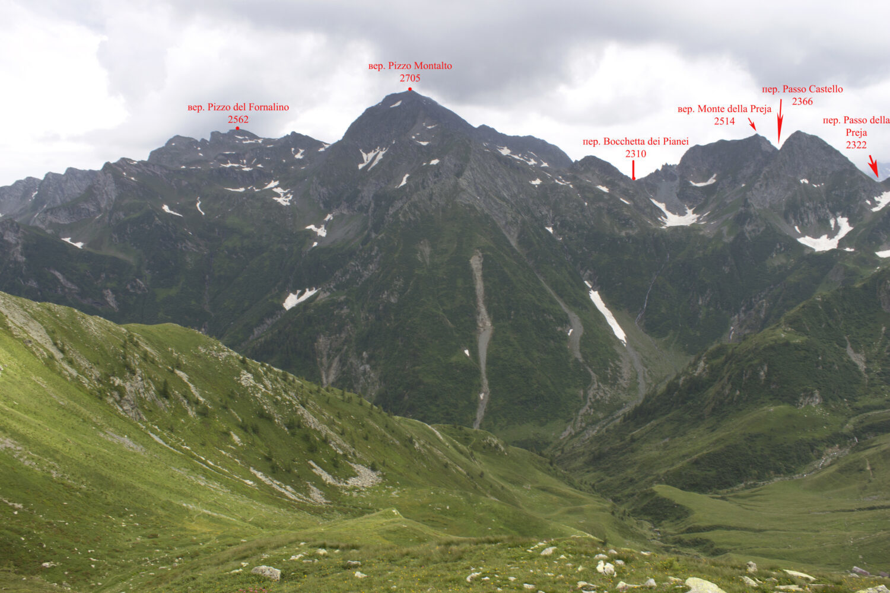
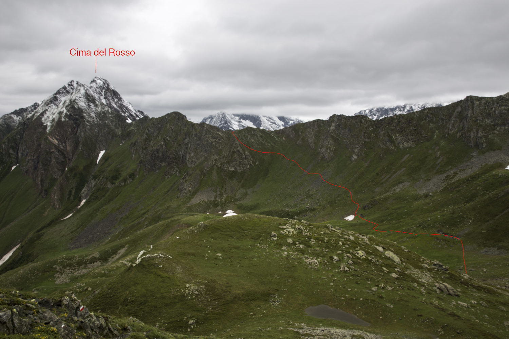
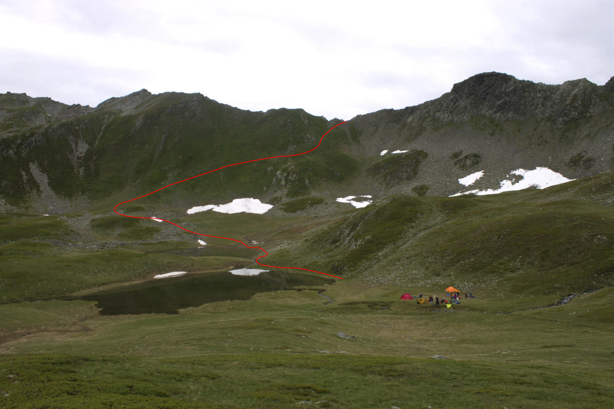
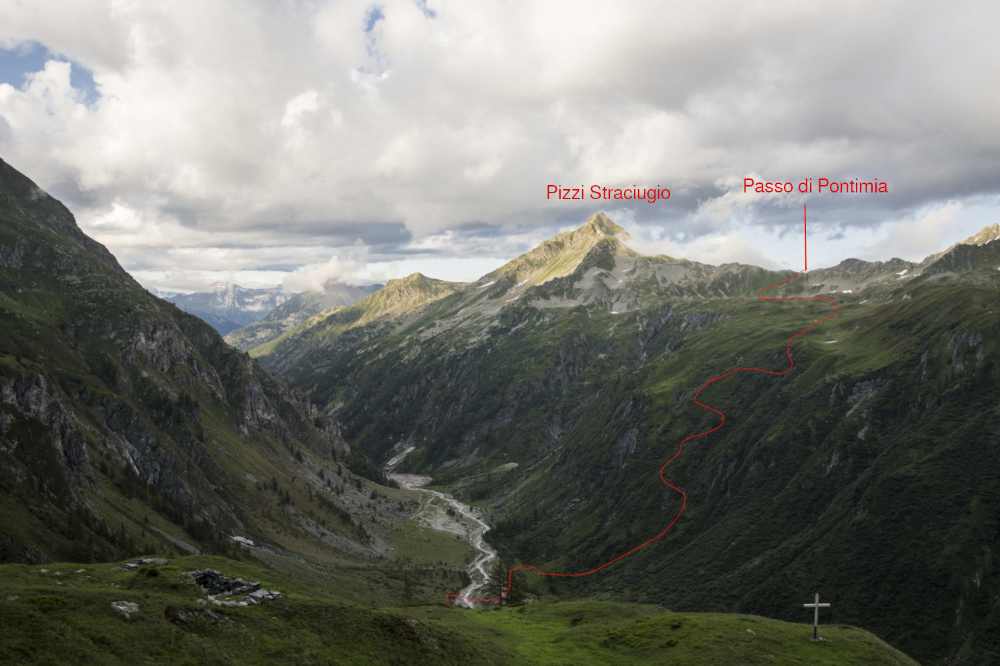
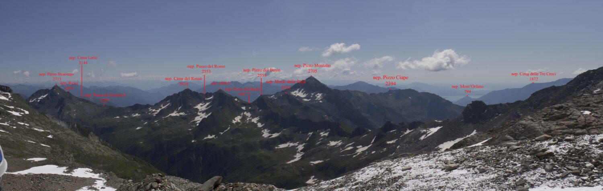
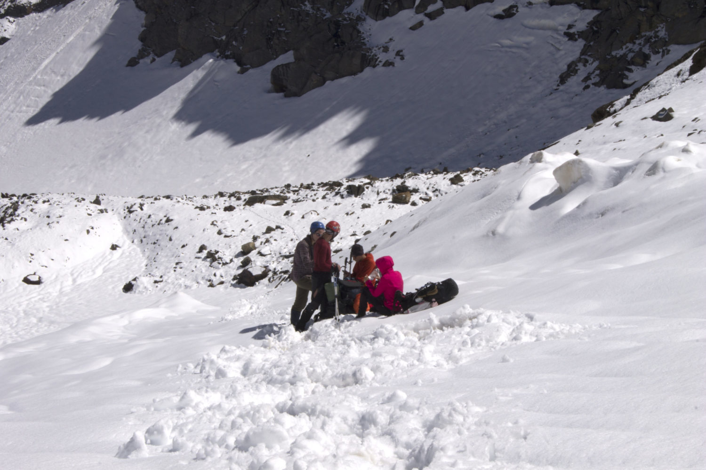
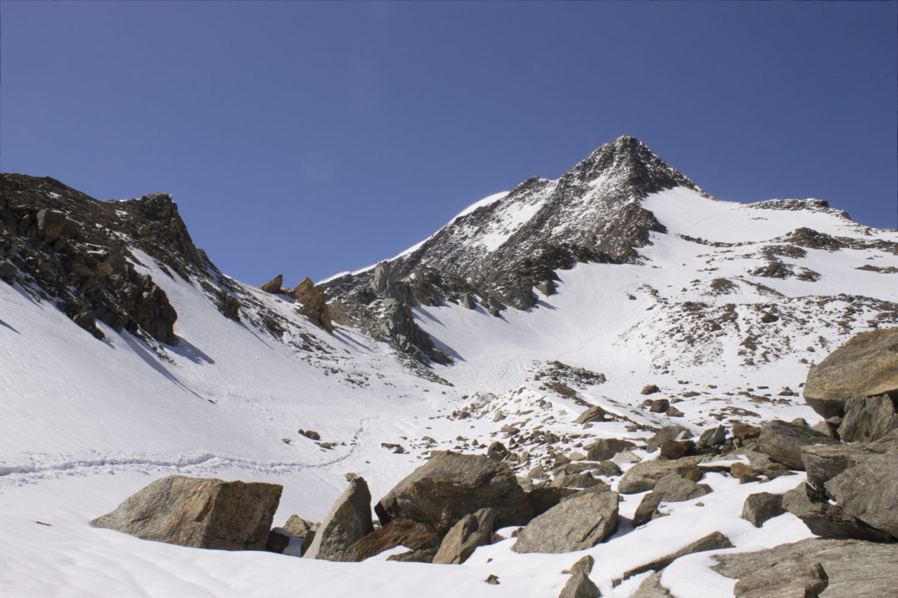
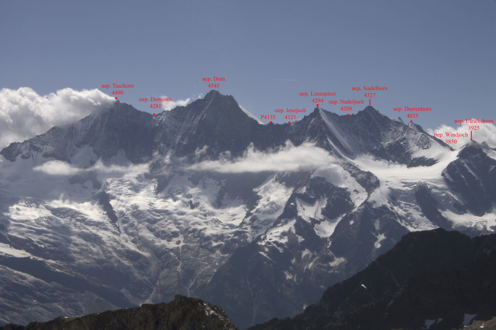
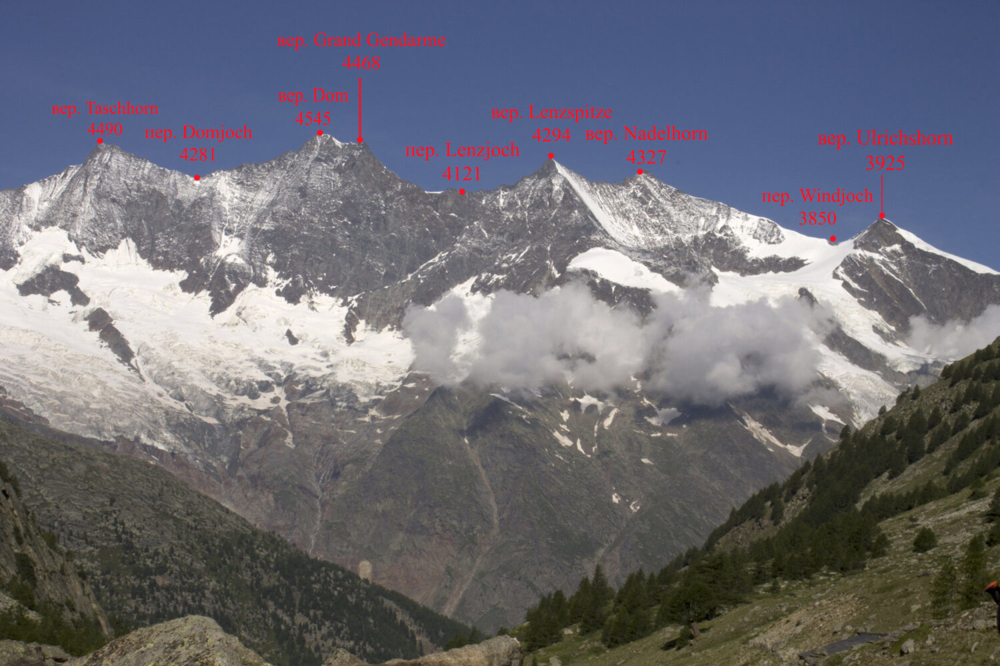

# Технические описания {#technical}

```{r  global_options, echo = FALSE}
knitr::opts_chunk$set(echo = FALSE, message = FALSE,
warning = FALSE)
```

## Перевал passo di Pontimia (1А, 2387)

### 14 июля

Дежурные 05:30, подъем в 06:30. Небо ясное, тепло. Собираем лагерь, перераспределяем продукты на первое кольцо и снаряжение между участниками. Вечером этого сделать не удалось, т.к. мы заехали в кемпинг когда уже начало смеркаться. Сборы заняли довольно долго времени.
Вышли из кемпинга только в 11:00.

```{r, fig.cap = "Кемпинг Yolki-Palki"}
knitr::include_graphics("photo/technical/20190714_d01_0816__mg_4921.jpg")
```
Возле входа в кемпинг стоит указатель с обозначениями троп и объектов, указанием времени до них и маркировой сложности тропы (обычно это желтая / красно-белая / сине-белая). До перевала обещают 4'05''. Начинаем подъём по хорошо ухоженной тропе. Тропа проходит по лесу, в тени деревьев.

```{r, fig.cap = "Кемпинг Yolki-Palki"}
knitr::include_graphics("photo/technical/20190714_d01_1114__mg_4938.jpg")
```

Через 30 минут подходим к месту с крутым набором высоты (~250 м). Здесь тропа начинает виться серпантином, набирать высоту по такой тропе -- одно удовольствие. 
В 12:30 выходим к развилке двух троп, здесь снова стоит указатель. К пер. Passo di Campo указано время 2'00''. По пути пересекаем несколько ручьёв и в 13:00 выходим к брошенному кошу Alpe Oriaccia. Здесь много мест под палатки и в 50м от руин стекает река Rio di Pizzanco. 

```{r, fig.cap = "Вид в дол. Domodossola перед пер. Groce di Valerio"}
knitr::include_graphics("photo/technical/20190714_d01_1330_img_7310.jpg")
```


Дальше тропа круто поворачивает и ведет на перевал 

Поднимаемся на пер. Groce di Valerio н/к, 1837) в 13:40. Это условный перевал, т.к. фактически мы поднялись просто на отрог. Рядом с тропой установлен металлический крест высотой 3,5 м и несколько мемориальных табличек. C перевала просматривается дол. р. Rio Vallaro с несколькими домиками и виден пер. Passo Di Campo.

```{r, fig.cap = "Вид c пер. Groce di Valerio в дол. р. Rio Vallaro"}
knitr::include_graphics("photo/technical/20190714_d01_1342__mg_4957.jpg")
```

От перевала тропа  резко сворачивает направо. За два перехода доходим под перевал к хиж. Rifugio Alpe il Laghetto (14:30). 
Ниже хижины располагаемся на обед на небольшой лужайке с ручьем. В самой хижине работает небольшое кафе, можно помыться, есть туалеты. Членам ФАР -- скидки.

```{r fig:day1_lunch, fig.cap = "Обед в дол. р. Rio Vallaro у хиж. Rifugio Alpe il Laghetto"}
knitr::include_graphics("photo/technical/20190714_d01_1549__mg_4976.jpg")
```

В 16:30 выходим на перевал Passo di Campo. Небо затянуто облаками. Возвращаемся к хижине и выходим на тропу. Седловина перевала отчётливо просматривается, левее седловины есть хороший ориентир -- ёлочка.

```{r, fig.cap = "Тропа на пер. Passo di Campo"}
knitr::include_graphics("photo/technical/20190714_d01_1629__mg_4980.jpg")
```

Поднимаемся по тропе и выходим на перевал (16:50). Седловина пер. Passo di Campo (2180, н/к) узкая, скальная, хорошо виден наш прошлый пер. Groce di Valerio. Наш следующий перевал Passo di Pontimia скрыт отрогом горы Pizzo Straciugo. Вниз с перевала  уходит тропа к Alpo di campi, на вид это очередная полузаброшенная постройка; направо тропа ведет к группе озер, возле самого большого из них -- Lagho di Campo, -- у нас запланирована ночёвка. Согласно указателю на тропе, до озера -- 01'20''.

```{r, fig.cap = "Вид на Domodosolla с пер. Passo di Campo"}

```

```{r, fig.cap = "Указатель на пер. Passo di Campo"}
knitr::include_graphics("photo/technical/20190714_d01_1701_img_7361.jpg")
```

```{r, fig.cap = "Вид на оз. Laghi di Campo с пер. Passo di Campo"}
knitr::include_graphics("photo/technical/20190714_d01_1703_img_7366.jpg")
```

Тропа пересекает поляну рододендронов. Соцветия маленькие фиолетовые, сами цветы меньше их кавказских собратьев. Выходим к небольшому озерцу, делаем привал и идём на разведку к оз. Lago di Campi -- проверить наличие стоянок. Возле озеро площадок, довольно много, возвращаемся к группе и все месте поднимаемся к озеру. Тропа проходит через сток озера. Мы разбиваем лагерь возле истока озера, на противоположном конце озера, на большой ровной поляне (19:30). Начинается дождь.

```{r, fig.cap = "Вид на вер. Pizzo Montalto (2705) от оз. 2230"}

```

```{r, fig.cap = "Вид на пер. Passo di Campo на подъёме к оз. Laghi di Campo"}
knitr::include_graphics("photo/technical/20190714_d01_1751__mg_5047.jpg")
```

```{r, fig.cap = "Лагерь у истока оз. Laghi di Campo"}
knitr::include_graphics("photo/technical/20190714_d01_2036__mg_5060.jpg")
```

### 15 июля

Подъём в 6:00. Завтрак 7:30. Всю ночь шел снег с дождём, видимость упала до 150 м, ждём погоды. 
В 10:30 дождь начал ослабевать, туман ушел, начинаем собирать лагерь. Выходим в 11:35, возвращаемся на тропу, начинаем подъём на отрог г. Pizzo Straciugo. 

```{r, fig.cap = "Вид на вер. Pizza Straciugo (2713) с оз. Laghi di Campo"}
knitr::include_graphics("photo/technical/20190715_d02_1114__mg_5094.jpg")
```

```{r, fig.cap = "Вид на вер. Clima d'Azoglio (2611) с оз. Laghi di Campo"}
knitr::include_graphics("photo/technical/20190715_d02_1200__mg_5112.jpg")
```

```{r, fig.cap = "Вид на вер. Pizzo Montalto (2705) с оз. Laghi di Campo"}
knitr::include_graphics("photo/technical/20190715_d02_1200__mg_5118.jpg")
```

```{r, fig.cap = "Тропа на отрог г. Pizzo Straciugo к пер. Passo di Pontimia"}
knitr::include_graphics("photo/technical/20190715_d02_1200__mg_5117.jpg")
```

Набираем 100 м высоты по тропе и выходим на отрог (12:15). Отсюда хорошо видно седловину пер. Passo di Pontimia и вер. Pizzo Ricco.

```{r, fig.cap = "Вер. Pizzo Straciugo с отрога"}
knitr::include_graphics("photo/technical/20190715_d02_1215_img_7460.jpg")
```

```{r, fig.cap = "Пер. Passo di Pontimia с отрога"}

```

```{r, fig.cap = "Оз. Passo di Pontimia и пер. Passo di Campo с отрога"}

```


Спускаемся вниз и продолжаем идти по тропе. Развилка на перевал обозначена надписью на камне. За два перехода от отрога поднимаемся по местами крутой тропе на перевал Passo di Pontimia (13:20). 

Перевал Passo di Pontimia (1A, 2387) расположен на границе Италии и Швейцарии, между вершинами Pizzo Straciugo и Cima del Rosso (2624). С перевальной седловины просматривается в обе стороны дол. р. Grosses wasser, видно место наших сегодняшних ночевок возле одинокого домика, расположенного на ур. Galki и наш следующий перевал -- пер. Zwischbergenpass. Ниже перевала раскинулась широкая терраса и группа оз. Laghi Pontimia. 

```{r, fig.cap = "Вид на отрог с пер. Passo di Pontimia"}

```

```{r, fig.cap = "Вер. Ricca (2534) и вер. Pizzo Straciugo (2713) с пер. Passo di Pontimia"}
knitr::include_graphics("photo/technical/20190715_d02_1320__mg_5159.jpg")
```

```{r, fig.cap = "Оз. Pontimia и пер. Zwischbergenpass с пер. Passo di Pontimia"}
knitr::include_graphics("photo/technical/20190715_d02_1335_img_7499.jpg")
```

Возле озер замечаем стадо горных козлов. Спускаемся по тропе к озерам и располагаемся на обед (13:40). Погода постепенно налаживается, тучи развеиваются.

```{r, fig.cap = "Пер. Passo di Pontimia от озёр Pontimia" }

```

В 16:30 выходим с места обеда, проходим по тропе через группу развалин возле озера и за один переход спускаемся к домику у развилки с указателями. Верхняя тропа ведет на пер. Passo d'Andolla (1А, 2418), нижняя -- спускается к р. Grosses Wassers. Мы уходим по нижней тропе.

```{r, fig.cap = "Пер. Passo di Pontimia" }
knitr::include_graphics("photo/technical/20190715_d02_1556_img_7545.jpg")
```

```{r, fig.cap = "Вид на пер. Zwischbergenpass от развилки на пер. Passo d'Andolla" }

```

```{r, fig.cap = "Пер. Zwischbergenpass  от развилки на пер. Passo d'Andolla" }
knitr::include_graphics("photo/technical/20190715_d02_1610__mg_5212.jpg")
```

```{r, fig.cap = "Домик у развилки" }
knitr::include_graphics("photo/technical/20190715_d02_1610__mg_5216.jpg")
```

Переходим ручей и спускаемся по крутой хорошо натоптанной тропе вниз, к реке Grosses Wasser. Начинаем искать возможность перейти реку (17:00). Ниже по течению виднеется мост через р. Grosses Wasser, но до него нужно идти примерно полтора-два км по тропе. Река не очень широкая, распределяемся и ищем место для брода. В 200 м выше по течению от слияния притоков р. Grosses Wasser находим перекаты и переходим вброд по ним на другой берег. Несмотря на прошедший дождь, уровень воды в реке оказался невысоким, течение не очень сильное, уровень воды чуть выше щиколотки. По левому берегу вдоль реки проложена тропа  к кошу Gmeinalp и дальше, к пер. Zwischbergenpass.

```{r, fig.cap = "Брод р. Grosses Wasser" }
knitr::include_graphics("photo/technical/20190715_d02_1744_img_7619.jpg")
```

```{r, fig.cap = "Путь в верховья р. Grosses Wasser" }
knitr::include_graphics("photo/technical/20190715_d02_1757_img_7630.jpg")
```


Проходим ур. Gmeinalp, оставляя справа в стороне дом пастуха, и начинаем подъём по хорошо маркированный тропе к ур. Galki на пути к пер. Zwischbergenpass.
За 2 перехода выходим выше каньона на луга. Здесь тропа резко разворачивается в противоположную сторону и уводит наверх, на хребет, вдоль скал. 

```{r, fig.cap = "Каньон р. Grosses Wasser и пер. Zwischbergenpass после ур. Gmeinalp" }
knitr::include_graphics("photo/technical/20190715_d02_1841_img_7660.jpg")
```

```{r, fig.cap = "Поворот после каньона р. Grosses Wasser" }
knitr::include_graphics("photo/technical/20190715_d02_1917_img_7665.jpg")
```

За один переход набираем ещё 150 м высоты и выходим к домику на урочище Galki. Дом и у туалет у дома закрыты на ключ, рядом с домом есть лохань, к которой подведён от ручья шланг с водой. Поднимаемся примерно на 20 выше домика по тропе и на высоте 2180 м находим ровные площадки, на которых встаем лагерем (19:40). Вода находится в 50 м правее площадок, или можно спуститься назад на 20 м вниз, к хижине. Рядом с лагерем пасётся стадо баранов. Примерно в 21:00  из-за противоположного склона выходит луна. Небо ясное, погода улучшилась.

```{r, fig.cap = "Вид на вер. Pizza Straciugo и пер. Passo di Pontimia с ур. Galki" }

```

## Перевал Zwischbergenpass (1Б, 3287)

### 16 июля

Подъём в 5:00 группа в 5:30. Ясно, безоблачно, свежо. Выходим в 8:00. Продолжаем подъём по тропе, поднимаемся на 2300. В это месте по другую сторону гребня также есть ровные площадки, на которых пасутся бараны. Вдоль тропы попадаются заросли рододендронов. Отсюда с тропы отчётливо видна седловина пер. Galkilucke (2828) и вер. Schijenhorn (2980).

```{r, fig.cap = "Вид на пер. Galkilucke (2828) и вер. Schijenhorn (2980) с выс. 2300" }
knitr::include_graphics("photo/technical/20190716_d03_0701__mg_5244.jpg")
```

```{r, fig.cap = "Вид на пер. Galkilucke (2828) и вер. Schijenhorn (2980) с выс. 2500" }
knitr::include_graphics("photo/technical/20190716_d03_0832__mg_5292.jpg")
```

```{r, fig.cap = "Тропа от ур. Galki" }
knitr::include_graphics("photo/technical/20190716_d03_0757__mg_5276.jpg")
```

На высоте 2500 через два перехода, тропа переваливает отрог, сужается и идёт вдоль крутых скал. В одном месте даже повешен металлический трос для подстраховки. В одном  месте осуществляем гимнастическую страховку для неуверенных участников. 

```{r, fig.cap = "Скальные прижимы после перехода через гребень" }
knitr::include_graphics("photo/technical/20190716_d03_0855__mg_5296.jpg")
```

Выходим на небольшую террасу, на которой лежит местами снег (09:00, 2490). Чуть ниже начала этой террасы есть ровные площадки, правда там нет воды, вода есть только в 70 м выше по по тропе, возле скал. Возле скал тоже можно найти площадки под отдельные палатки, но сделать это сложнее. 

От скал тропа ведёт наверх, здесь пробит маршрут виа феррата. Надеваем каски и двигаясь плотной группой набираем 30 м высоты, придерживаясь за тросы. Начиная с этого момента маркировка тропы меняет цвет на синий. После подъёма открывается вид на верховья р. Grosses Wasser, видны вер. Tossenhorn (3225), вер. Tallihorn (3448) и на другом борту дол. -- вер. Piazzo d'Andolla (3654). По пути встречаем горных козлов.  Животные не сильно смущаются вида человека и спокойно прохаживаются по скалам.

```{r, fig.cap = "Скальный маршрут виа феррата" }
knitr::include_graphics("photo/technical/20190716_d03_0923__mg_5299.jpg")
```

```{r, fig.cap = "Вид на вер. Tossenhorn (3225) и вер. Tallihorn (3448) после подъёма на скалы" }
knitr::include_graphics("photo/technical/20190716_d03_0949_img_7831.jpg")
```

```{r, fig.cap = "Горный козёл на тропе" }
knitr::include_graphics("photo/technical/20190716_d03_0955_img_7846.jpg")
```


Через три перехода тропе подводит нас к левой боковой морене ледника, на которую мы выходим (11:30, 2790). Пересекаем ещё две морены, ориентируясь по синим маркерам и выходим на последнюю морену перед ледником возле ручья. Здесь надеваем кошки и пополняем запасы питьевой воды, так как дальше по карте воды не будет. Спускаемся на лед. Zwischbergengletcher (закрытый) и продолжаем движение по леднику. Связки здесь не нужны, так как трещин на этом леднике нет. Начинает сильно припекать солнце (12:00).

```{r, fig.cap = "Вид с боковой лед. морены назад в дол. р. Grosses Wasser" }

```

```{r, fig.cap = "Вид с боковой лед. морены на массив вер. Pizzo d'Andolla (3654)" }
knitr::include_graphics("photo/technical/20190716_d03_1126__mg_5329.jpg")
```

В 12:30 выходим в перевальный цирк. Открывается вид на стену пер. Zwischbergenpass, которая была прежде закрыта отрогом вер. Tallihorn. Перевал расположен прямо перед нами, но в лоб подниматься на него нельзя, нужно обходить стену справа. Растягиваем тент от солнца и располагаемся холодный обед.

```{r, fig.cap = "Вид стену пер. Zwischbergenpass с лед. Zwischbergengletcher" }
knitr::include_graphics("photo/technical/20190716_d03_1240__mg_5340.jpg")
```

Выходим с обеда и продолжаем подъём на перевал (13:10). За поворотом наконец-то открывается вид на вер. Weissmies (4023). За один переход подходим к боковой морене ледника, и по синей маркировка выходим на натоптанную тропу -- заход на перевал. 

```{r, fig.cap = "Вер. Weismiss (4024) с лед. Zwischbergengletcher" }
knitr::include_graphics("photo/technical/20190716_d03_1314__mg_5344.jpg")
```

```{r, fig.cap = "Вер. Weismiss (4024) с лед. Zwischbergengletcher" }
knitr::include_graphics("photo/technical/20190716_d03_1459__mg_5360.jpg")
```

```{r, fig.cap = "Боковая морена лед. Zwischbergengletcher и вер. Pizzo d'Andolla" }
knitr::include_graphics("photo/technical/20190716_d03_1514__mg_5377.jpg")
```


Через один переход встречаем группу немецких школьников (15:00). Девушка держится руками за живот, как выяснилось, у неё сильные спазмы. Медик выдал ей мягкое обезболивающее но-шпа и затем мы поговорили с парнем. Ребята планировали спускаться вниз в долину с перевала и выйти к автобусной остановке. Нам удалось убедить их, что безопаснее будет повернуть назад, к хижине. Помогаем разгрузить девушку и сопрождаем ребят до отеля Almageller Alp. Ребята рассказали нам, что возле этого отеля можно спокойно расположиться в палатке, правда, сперва нужно попросить разрешения у хозяев отеля. 

```{r, fig.cap = "Оказание помощи немецким школьникам" }

```


С места, где мы встретили ребят, тропа уходит наверх по крутому снежному склону крутизной до 30 градусов. Снова надеваем кошки, т.к. снег к этому времени уже порядочно раскис и поднимаемся на ложную седловину. Направо уходит тропа на вер. Weissmies. Пока мы перекладывали вещи девушки нас обогнала группы пенсионеров из Бельгии, поэтому пока они неспешно перебирались на истинную седловину по скалам, мы сделали перевальное фото и съели перевальный шоколад.  

```{r, fig.cap = "Подъём на ложную седловину Zwischbergenpass" }
knitr::include_graphics("photo/technical/20190716_d03_1541_img_7906.jpg")
```

```{r, fig.cap = "Развилка тропы с пер. Zwischbergenpass на вер. Weissmies" }

```

```{r, fig.cap = "Ложная седловина Zwischbergenpass и вер. Pizzo d'Andolla" }

```

В 16:50 траверсируя 70 м по крупной скальной осыпи выходим на истинную седловину перевала. Пер. Zwischbergenpass (1Б, 3268) соединяет дол. р. Grosses Wasser и дол. р. Almagellerbach, расположен между вершинами Weissmies (4023) и вер. Pizzo d'Andolla (3654). Перевал крайне популярен благодаря тому, что с этого перевала ведёт самый простой маршрут на вер. Weissmies -- одной из самых популярных вершин Пеннинских Альп. Также перевал крайне популярен среди любителей ски-тура, т.к. зимой можно быстро спуститься по замерзающей р. Grosses Wasser вниз к автомобильной дороге. Летом же в эту долину ходят реже из-за сравнительно неразвитой инфраструктуры.

На седловине установлен указатель с маршрутами на соседние вершины и назад в долину. С седловины перевала открывается замечательный вид на горный массив Mischabel. Виден все основные вершины хребта и наши следующие препятствия -- пер. Windjoch и вер. Ulrichshorn. 

```{r, fig.cap = "Вид с пер. Zwischbergenpass на горный массив Mischabel" }
knitr::include_graphics("photo/technical/20190716_d03_1624__mg_5414.jpg")
```

```{r, fig.cap = "Вид на основные вер. Mischabel с пер. Zwischbergenpass" }

```

Начинаем спуск c пер. к хиж. Almagellerhütte, которую хорошо видно с седловины перевала. Спуск хижине оказалась существенно более пологим чем это было указано в описаниях. За два перехода спускаемся к хижине. По пути попадались оборудованные ветрозащищённые стоянки, вода стекает со скал. Вечером и утро на перевале дует сильный ветер, поэтому нужно заботиться ветрозащите. 

```{r, fig.cap = "Вид на пер. Zwischbergenpass из дол. р. Almagellerbach" }
knitr::include_graphics("photo/technical/20190716_d03_1731_img_8010.jpg")
```

```{r, fig.cap = "Вид на пер. Zwischbergenpass от хиж. Almagellerhütte" }

```


Подходим к хижине и делаем привал (17:50). К хижине ведёт мостик через речку. Здесь уже расположились пенсионеры, которых мы встретили раньше. В хижине работает кафе и летняя веранда. В самом кафе мы насчитали 3 человека персонала. Цены здесь довольно высокие даже по швейцарским меркам, растворимый кофе стоит примерно 6 франков за чашку, ночлег стоит очень дорого. Всё понятно -- это популярная точка для восхождения на Weissmies. 

```{r, fig.cap = "Хиж. Almagellerhütte" }
knitr::include_graphics("photo/technical/20190716_d03_1757__mg_5442.jpg")
```

Уходим по указателям налево и продолжаем спуск вниз в долину. Тропа иногда распадается и сходится снова,  нужно всё время придерживаться правого борта долины. По пути попадается ручьи, которые ниже сливаются в приток р. Almagellerbach -- Lehbach. В общей сложности за 5 переходов мы спустились к отелю Almagelleralp (19:45, 2200 м).

```{r, fig.cap = "Спуск в дол. Almagellerbach и отель Almagelleralp" }
knitr::include_graphics("photo/technical/20190716_d03_1845_img_8016.jpg")
```

```{r, fig.cap = "Вид назад на тропу к хиж. Almagellerhütte" }
knitr::include_graphics("photo/technical/20190716_d03_1933__mg_5470.jpg")
```

Прощаемся со школьниками -- в этот раз они решили заночевать в отеле, после чего идём к хозяевам  отеля и просим разрешения встать на лужайке. Хозяева нам разрешили встать палатками, при условии что мы будем пользоваться удобствами в отеле. В отеле есть вода, бесплатные туалеты и кафе. Кафе работает до 22:00. Напитки и еда в кафе самые дешёвые, продаются с большой наценкой. Внутри есть плакаты с историей отеля. Оказалось, что этому отелю уже больше ста лет, но в восьмидесятые годы он был полностью разрушен стихией, и в конце восьмидесятых его отстроили заново? при этом из бюджета было выделено 440000 франков на восстановление. Сегодня это популярная остановка для тех кто совершает простой хайкинг в долине. Все продукты доставляются в хижину вертолетами, которые также вывозят мусор. Отсюда такие наценки в Швейцарии за продукты.

```{r, fig.cap = "Отель Almagelleralp" }

```


### 17 июля

Дежурные 6:30, группа 7:00. Выходим в 9:20. Солнечно, не жарко. Спускаемся вдоль левого берега р. Almagellerbach к кемпингу возле дер. Saas-grund. Ориентируемся по указателям на Moosgufer / zum Moos / am Boden, указатели Militärweg нужно игнорировать.

```{r, fig.cap = "Указатель у отеля Almagelleralp" }

```

```{r, fig.cap = "Вид на вер. Almagellerhorn (3327 м) от отеля Almagelleralp" }
knitr::include_graphics("photo/technical/20190717_d04_0845__mg_5486.jpg")
```

```{r, fig.cap = "Вид на основые вершины массива Mischabel" }

```

В 10:00 проходим мимо моста через р. Almagellerbach (2065 м). Тропа через мост ведёт к дер. Saas-Almagell. Продолжаем идти по левому берегу р., тропа постепенно заворачивает направо и всё сильнее уходит вниз. На повороте дорога выходит из леса и нам открывается вид на дер. Saas-Almagel внизу и дер. Saas-Fee в соседней долине. Виднеется также подъёмник Hannig, на котором обычно альпинисты "срезают" путь подъёма к хиж. Mischabellhutte. На высоте 1850 тропа последний раз предлагает уйти налево, к Saas-Almagell.

```{r, fig.cap = "Указатель у моста через р. Almagellerbach" }

```

```{r, fig.cap = "Дер. Saas-Almagell" }
knitr::include_graphics("photo/technical/20190717_d04_1019__mg_5533.jpg")
```

```{r, fig.cap = "Вид на дер. Saas-Fee и подъёмник Hannig (2330)" }
knitr::include_graphics("photo/technical/20190717_d04_1025__mg_5545.jpg")
```

```{r, fig.cap = "Развилка к Saas-Almagell и мост через р. Almagellerbach (1850)" }

```

После развилки тропа опять ныряет в сосновый лес. В 11:00 проходим поворот и спуск "Zum stäg". С развилки видно, как спуск упирается в автомобильную дорогу и мост через реку Visp, который ведёт к кемпингу Schönblick. Этот кемпинг примыкает к шоссе и возле него довольно шумно, поэтому мы решили идти дальше по тропе к запланированному кемпингу Am Kapellenweg. Через 15 минут тропа плавно уходит вверх, потом резко спускается вниз к дороге и кемпингу Kapellenweg.

```{r, fig.cap = "Тропа к кемпингу Kapellenweg" }
knitr::include_graphics("photo/technical/20190717_d04_1135_img_8096.jpg")
```

Переходим реку Saaser-Vispa и заходим на территорию кемпинга (12:00). Регистрация открывается только в 14:00, но нас пускают на территорию. Здесь ровные подстриженные лужайки, есть четыре душевых кабины, раковины для стирки вещей и посуды, магазинчик с газом и хлебом и другими продуктами. В одном километре ниже по дороге, в дер. Saas-Grund есть супермаркет Coop, там также можно пополнить запасы продуктов.

В местных кемпингах принятно платить отдельно за каждого человека (7 Fr.) и отдельно за каждую паплатку (10 Fr). В долине Saastal действует ещё дополнительное правило на покупку дневного проездного на автобусы в этой долине. Ставим палатки, попутно знакомимся с украинской альпинистской, которая рассказала нам, что место в хижине Mischabelhütte нужно бронировать заранее, и скорее всего мест уже нет. 

На ресепшене мы звоним в хижину, и к счастью под такую большую группу у них места находятся, однако проживание с пансионом невозможно, и нам придётся жить в неотапливаемом зимнем домике. Мы спрашиваем можно ли будет готовить внутри домика, и нам говорят что можно. Бронируем зимний домик и располагаемся на полудневку. 

```{r, fig.cap = "Кемпинг Am Kapellenweg (1572)" }

```


## Траверс пер. Windjoch (1Б, 3850) -- вер. Ulrichshorn (1Б, 3925)

### 18 июля (подъем к хиж. Mischabelhütte)

### 19 июля

### 20 июля

## Перевал P3824 (1Б, 3824) -- вер. Breithorn (1Б, 4164)

### 22 июля 

### 23 июля

## Перевал Colletto di Nanа (1Б?, 2850)

### 24 июля

## Траверс пер. Col de Nannаz (1А, 2773) -- пер. Col des Fontaines (1А, 2696)

### 25 июля

### 26 июля
