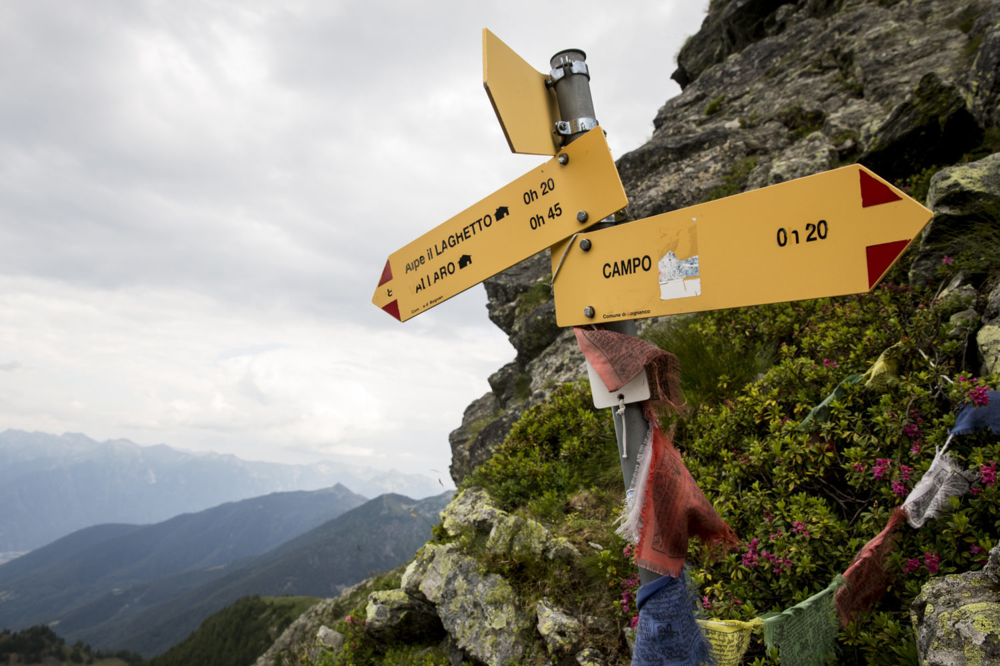
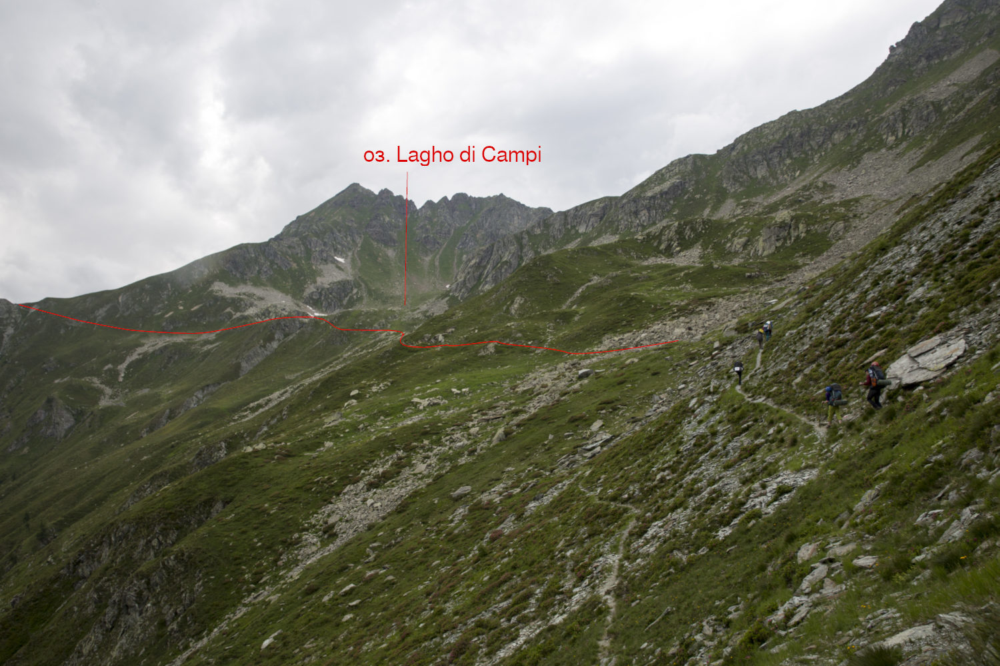
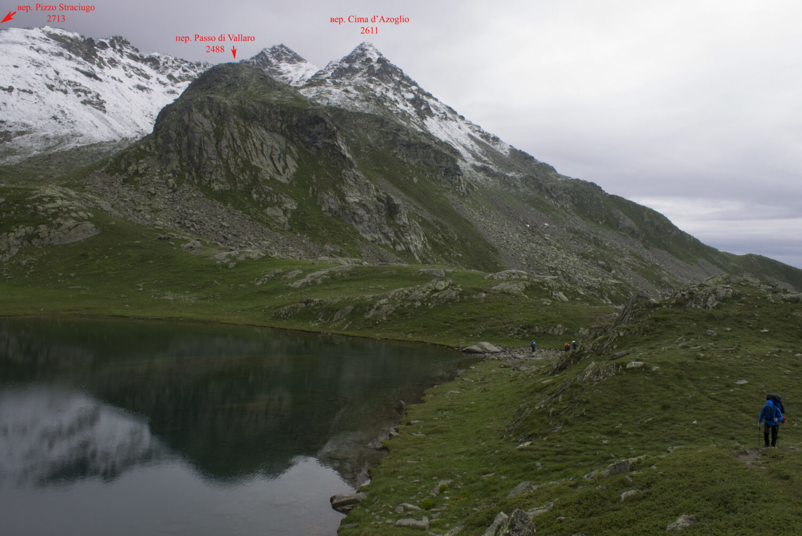
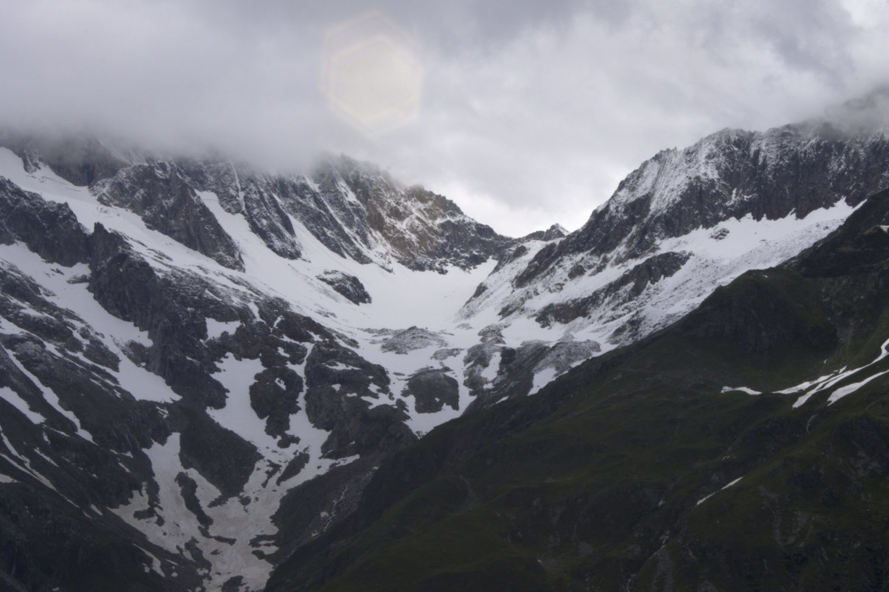
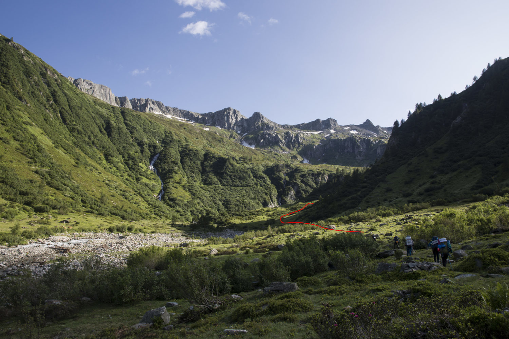

# Технические описания {#technical}

```{r  global_options, echo = FALSE}
knitr::opts_chunk$set(echo = FALSE, message = FALSE,
warning = FALSE)
```

## Перевал passo di Pontimia (1А, 2387)

### 14 июля

Дежурные 05:30, подъем в 06:30. Небо ясное, тепло. Собираем лагерь, перераспределяем продукты на первое кольцо и снаряжение между участниками. Вечером этого сделать не удалось, т.к. мы заехали в кемпинг когда уже начало смеркаться. Сборы заняли довольно долго времени.
Вышли из кемпинга только в 11:00.

```{r, fig.cap = "Кемпинг Yolki-Palki"}
knitr::include_graphics("photo/technical/20190714_d01_0816__mg_4921.jpg")
```
Возле входа в кемпинг стоит указатель с обозначениями троп и объектов, указанием времени до них и маркировой сложности тропы (обычно это желтая / красно-белая / сине-белая). До перевала обещают 4'05''. Начинаем подъём по хорошо ухоженной тропе. Тропа проходит по лесу, в тени деревьев.

```{r, fig.cap = "Кемпинг Yolki-Palki"}

```

Через 30 минут подходим к месту с крутым набором высоты (~250 м). Здесь тропа начинает виться серпантином, набирать высоту по такой тропе -- одно удовольствие. 
В 12:30 выходим к развилке двух троп, здесь снова стоит указатель. К пер. Passo di Campo указано время 2'00''. По пути пересекаем несколько ручьёв и в 13:00 выходим к брошенному кошу Alpe Oriaccia. Здесь много мест под палатки и в 50м от руин стекает река Rio di Pizzanco. 

```{r, fig.cap = "Вид в дол. Domodossola перед пер. Groce di Valerio"}
knitr::include_graphics("photo/technical/20190714_d01_1330_img_7310.jpg")
```


Дальше тропа круто поворачивает и ведет на перевал 

Поднимаемся на пер. Groce di Valerio н/к, 1837) в 13:40. Это условный перевал, т.к. фактически мы поднялись просто на отрог. Рядом с тропой установлен металлический крест высотой 3,5 м и несколько мемориальных табличек. C перевала просматривается дол. р. Rio Vallaro с несколькими домиками и виден пер. Passo Di Campo.

```{r, fig.cap = "Вид c пер. Groce di Valerio в дол. р. Rio Vallaro"}

```

От перевала тропа  резко сворачивает направо. За два перехода доходим под перевал к хиж. Rifugio Alpe il Laghetto (14:30). 
Ниже хижины располагаемся на обед на небольшой лужайке с ручьем. В самой хижине работает небольшое кафе, можно помыться, есть туалеты. Членам ФАР -- скидки.

```{r fig:day1_lunch, fig.cap = "Обед в дол. р. Rio Vallaro у хиж. Rifugio Alpe il Laghetto"}

```

В 16:30 выходим на перевал Passo di Campo. Небо затянуто облаками. Возвращаемся к хижине и выходим на тропу. Седловина перевала отчётливо просматривается, левее седловины есть хороший ориентир -- ёлочка.

```{r, fig.cap = "Тропа на пер. Passo di Campo"}

```

Поднимаемся по тропе и выходим на перевал (16:50). Седловина пер. Passo di Campo (2180, н/к) узкая, скальная, хорошо виден наш прошлый пер. Groce di Valerio. Наш следующий перевал Passo di Pontimia скрыт отрогом горы Pizzo Straciugo. Вниз с перевала  уходит тропа к Alpo di campi, на вид это очередная полузаброшенная постройка; направо тропа ведет к группе озер, возле самого большого из них -- Lagho di Campo, -- у нас запланирована ночёвка. Согласно указателю на тропе, до озера -- 01'20''.

```{r, fig.cap = "Вид на Domodosolla с пер. Passo di Campo"}
knitr::include_graphics("photo/technical/20190714_d01_1647_img_7359.jpg")
```

```{r, fig.cap = "Указатель на пер. Passo di Campo"}

```

```{r, fig.cap = "Вид на оз. Laghi di Campo с пер. Passo di Campo"}

```

Тропа пересекает поляну рододендронов. Соцветия маленькие фиолетовые, сами цветы меньше их кавказских собратьев. Выходим к небольшому озерцу, делаем привал и идём на разведку к оз. Lago di Campi -- проверить наличие стоянок. Возле озеро площадок, довольно много, возвращаемся к группе и все месте поднимаемся к озеру. Тропа проходит через сток озера. Мы разбиваем лагерь возле истока озера, на противоположном конце озера, на большой ровной поляне (19:30). Начинается дождь.

```{r, fig.cap = "Вид на вер. Pizzo Montalto (2705) от оз. 2230"}
knitr::include_graphics("photo/technical/20190714_d01_1716__mg_5021.jpg")
```

```{r, fig.cap = "Вид на пер. Passo di Campo на подъёме к оз. Laghi di Campo"}

```

```{r, fig.cap = "Лагерь у истока оз. Laghi di Campo"}
knitr::include_graphics("photo/technical/20190714_d01_2036__mg_5060.jpg")
```

### 15 июля

Подъём в 6:00. Завтрак 7:30. Всю ночь шел снег с дождём, видимость упала до 150 м, ждём погоды. 
В 10:30 дождь начал ослабевать, туман ушел, начинаем собирать лагерь. Выходим в 11:35, возвращаемся на тропу, начинаем подъём на отрог г. Pizzo Straciugo. 

```{r, fig.cap = "Вид на вер. Pizza Straciugo (2713) с оз. Laghi di Campo"}
knitr::include_graphics("photo/technical/20190715_d02_1114__mg_5094.jpg")
```

```{r, fig.cap = "Вид на вер. Clima d'Azoglio (2611) с оз. Laghi di Campo"}

```

```{r, fig.cap = "Вид на вер. Pizzo Montalto (2705) с оз. Laghi di Campo"}
knitr::include_graphics("photo/technical/20190715_d02_1200__mg_5118.jpg")
```

```{r, fig.cap = "Тропа на отрог г. Pizzo Straciugo к пер. Passo di Pontimia"}
knitr::include_graphics("photo/technical/20190715_d02_1200__mg_5117.jpg")
```

Набираем 100 м высоты по тропе и выходим на отрог (12:15). Отсюда хорошо видно седловину пер. Passo di Pontimia и вер. Pizzo Ricco.

```{r, fig.cap = "Вер. Pizzo Straciugo с отрога"}
knitr::include_graphics("photo/technical/20190715_d02_1215_img_7460.jpg")
```

```{r, fig.cap = "Пер. Passo di Pontimia с отрога"}
knitr::include_graphics("photo/technical/20190715_d02_1212_img_7450.jpg")
```

```{r, fig.cap = "Оз. Passo di Pontimia и пер. Passo di Campo с отрога"}
knitr::include_graphics("photo/technical/20190715_d02_1219__mg_5127.jpg")
```


Спускаемся вниз и продолжаем идти по тропе. Развилка на перевал обозначена надписью на камне. За два перехода от отрога поднимаемся по местами крутой тропе на перевал Passo di Pontimia (13:20). 

Перевал Passo di Pontimia (1A, 2387) расположен на границе Италии и Швейцарии, между вершинами Pizzo Straciugo и Cima del Rosso (2624). С перевальной седловины просматривается в обе стороны дол. р. Grosses wasser, видно место наших сегодняшних ночевок возле одинокого домика, расположенного на ур. Galki и наш следующий перевал -- пер. Zwischbergenpass. Ниже перевала раскинулась широкая терраса и группа оз. Laghi Pontimia. 

```{r, fig.cap = "Вид на отрог с пер. Passo di Pontimia"}
knitr::include_graphics("photo/technical/20190715_d02_1316_img_7481_1.jpg")
```

```{r, fig.cap = "Вер. Ricca (2534) и вер. Pizzo Straciugo (2713) с пер. Passo di Pontimia"}

```

```{r, fig.cap = "Оз. Pontimia и пер. Zwischbergenpass с пер. Passo di Pontimia"}
knitr::include_graphics("photo/technical/20190715_d02_1335_img_7499.jpg")
```

Возле озер замечаем стадо горных козлов. Спускаемся по тропе к озерам и располагаемся на обед (13:40). Погода постепенно налаживается, тучи развеиваются.

```{r, fig.cap = "Пер. Passo di Pontimia от озёр Pontimia" }
knitr::include_graphics("photo/technical/20190715_d02_1407__mg_5194.jpg")
```

В 16:30 выходим с места обеда, проходим по тропе через группу развалин возле озера и за один переход спускаемся к домику у развилки с указателями. Верхняя тропа ведет на пер. Passo d'Andolla (1А, 2418), нижняя -- спускается к р. Grosses Wassers. Мы уходим по нижней тропе.

```{r, fig.cap = "Пер. Passo di Pontimia" }
knitr::include_graphics("photo/technical/20190715_d02_1556_img_7545.jpg")
```

```{r, fig.cap = "Вид на пер. Zwischbergenpass от развилки на пер. Passo d'Andolla" }
knitr::include_graphics("photo/technical/20190715_d02_1602_img_7546.jpg")
```

```{r, fig.cap = "Пер. Zwischbergenpass  от развилки на пер. Passo d'Andolla" }

```

```{r, fig.cap = "Домик у развилки" }
knitr::include_graphics("photo/technical/20190715_d02_1610__mg_5216.jpg")
```

Переходим ручей и спускаемся по крутой хорошо натоптанной тропе вниз, к реке Grosses Wasser. Начинаем искать возможность перейти реку (17:00). Ниже по течению виднеется мост через р. Grosses Wasser, но до него нужно идти примерно полтора-два км по тропе. Река не очень широкая, распределяемся и ищем место для брода. В 200 м выше по течению от слияния притоков р. Grosses Wasser находим перекаты и переходим вброд по ним на другой берег. Несмотря на прошедший дождь, уровень воды в реке оказался невысоким, течение не очень сильное, уровень воды чуть выше щиколотки. По левому берегу вдоль реки проложена тропа  к кошу Gmeinalp и дальше, к пер. Zwischbergenpass.

```{r, fig.cap = "Брод р. Grosses Wasser" }

```

```{r, fig.cap = "Путь в верховья р. Grosses Wasser" }

```


Проходим ур. Gmeinalp, оставляя справа в стороне дом пастуха, и начинаем подъём по хорошо маркированный тропе к ур. Galki на пути к пер. Zwischbergenpass.
За 2 перехода выходим выше каньона на луга. Здесь тропа резко разворачивается в противоположную сторону и уводит наверх, на хребет, вдоль скал. 

```{r, fig.cap = "Каньон р. Grosses Wasser и пер. Zwischbergenpass после ур. Gmeinalp" }
knitr::include_graphics("photo/technical/20190715_d02_1841_img_7660.jpg")
```

```{r, fig.cap = "Поворот после каньона р. Grosses Wasser" }
knitr::include_graphics("photo/technical/20190715_d02_1917_img_7665.jpg")
```

За один переход набираем ещё 150 м высоты и выходим к домику на урочище Galki. Дом и у туалет у дома закрыты на ключ, рядом с домом есть лохань, к которой подведён от ручья шланг с водой. Поднимаемся примерно на 20 выше домика по тропе и на высоте 2180 м находим ровные площадки, на которых встаем лагерем (19:40). Вода находится в 50 м правее площадок, или можно спуститься назад на 20 м вниз, к хижине. Рядом с лагерем пасётся стадо баранов. Примерно в 21:00  из-за противоположного склона выходит луна. Небо ясное, погода улучшилась.

```{r, fig.cap = "Вид на вер. Pizza Straciugo и пер. Passo di Pontimia с ур. Galki" }
knitr::include_graphics("photo/technical/20190715_d02_2013_img_7699.jpg")
```


## Перевал Zwischbergenpass (1Б, 3287)

### 16 июля

### 17 июля

## Траверс пер. Windjoch (1Б, 3850) -- вер. Ulrichshorn (1Б, 3925)


### 18 июля (подъем к хиж. Mischabelhütte)

### 19 июля

### 20 июля

## Перевал P3824 (1Б, 3824) -- вер. Breithorn (1Б, 4164)

### 22 июля 

### 23 июля

## Перевал Colletto di Nanа (1Б?, 2850)

### 24 июля

## Траверс пер. Col de Nannаz (1А, 2773) -- пер. Col des Fontaines (1А, 2696)

### 25 июля

### 26 июля
