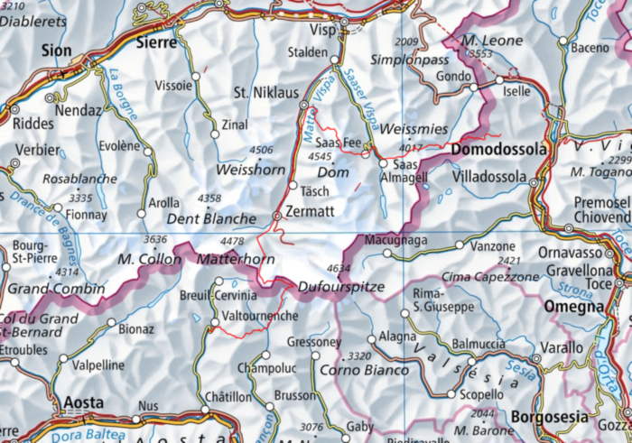
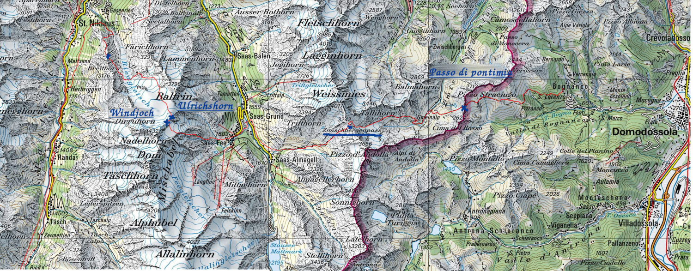
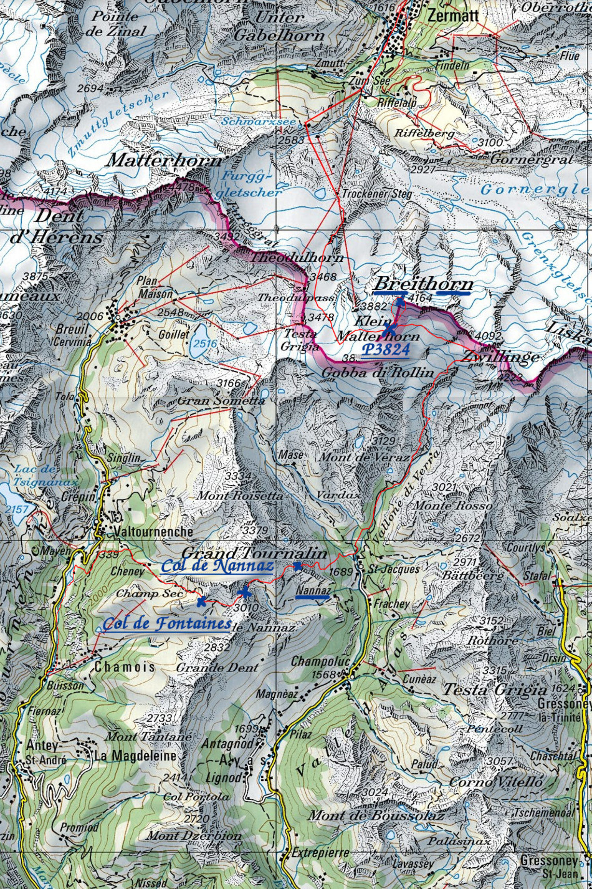

--- 
title: "Отчёт о горном походе 2 к.с.\ Пеннинские Альпы"
author: "Коровин Владимир"
email: "<dimcoker@yandex.ru>"
site: bookdown::bookdown_site
output: 
  bookdown::gitbook:  
    split_by: "section"
documentclass: book
link-citations: yes
github-repo: vrkrv/alps19
description: "Отчёт о горном походе"
---

```{r  global_options, echo = FALSE}
knitr::opts_chunk$set(echo = FALSE, message = FALSE,
warning = FALSE)
```

# Справочные сведения

- Вид туризма: Горный
- Район: Западные Альпы / Пеннинские Альпы
- Категория сложности: вторая
- Количество участников: 13
- Сроки проведения: 14.07.2019 - 26.07.2019
- Продолжительность: 13 дней
- Протяженность: 105 км / 126 км*
- Набор высоты: 11 км
- Нитка маршрута: ст. Yolki-Palki (Bognanco) -- пер. Passo di Campo (н/к, 2180) -- пер. Passo di Pontimia (1А, 2387) -- пер. Zwischenbergen (1Б, 3287) -- пос. Saas-Almagel -- пер. Windjoch (1Б, 3850, сн-ск) -- вер. Ulrichshorn (1Б, 3925) -- хиж. Bordierhutte -- пер. P2664 (2664, н/к) -- пос. Zermatt -- пер. P3824 (1Б, сн-лд.) -- вер. Breithorn (1Б, 4164, рад.) -- Bivacco Rossi e Volante (3700) -- р. Torrente Curtod -- пер. Сolletto di Nano (1А, 2650) -- пер. Col de Nannaz (1А, 2773) -- Camping Glair -- пос. Grand Moulin -- гор. St.Vincent
- Пройдено перевалов и вершин: 9
  - 1Б - 5 шт
  - 1А - 3 шт
- Максимальная высота: 4 164 м (вер. Breithorn)
- Максимальная высота ночевки: 3824 (пер. P3824)

## Список участников

```{r}
library(dplyr)
library(knitr)
library(kableExtra)
options(knitr.kable.NA = '')
member_list <- readr::read_tsv("data/member_list.tsv")
knitr::kable(member_list)
```


## Запланированный и пройденный маршрут

```{r}
plan_df <- readxl::read_xlsx("data/plan.xlsx")
kable(plan_df) %>%
  kable_styling(bootstrap_options = "striped", full_width = F)
```

Отклонения от маршрута:

1. День 8. Из-за того, что тропа Europaweg к хиж. Europahutte была перекрыта, вынуждены были пройти по нижней тропе, сделав крюк в 2,5 км. В результате мы не успевали в кемпинг Tasch и остановились в кемпинге рядом с ним -- кемпинг Rand.
2. День 12а. Вместо прямого спуска в дер. Nuarsazz был выбран альтернативный маршрут через пер. Col de Fontaines. Оба варианта равноцены по сложности прохождения, посчитали, что интереснее будет пройти через более-менее пустынную местность, чем спускаться через горнолыжный курорт. Также мы совершили на 12 день радиальное восхождение с перевала Col de Nannaz на обзорную вер. Becca Trecare (н/к, 3032), к которой вела тропа с перевала.
3. День 13b. Вместо пешего путешествия по автомобильной дороге к гор. Chatillon прошли только часть маршрута, которая проходила по тропе вдоль дороги до дер. Grand Moullin. От дер. Grand Moullin доехали до гор. Chatillon на автобусе, т.к. тропы после этого места нет, и пришлось бы идти по обочине дороги.

## Схема маршрута

```{r, fig.cap = "Карта района"}

```

```{r, fig.cap = "Первое кольцо"}

```

```{r, fig.cap = "Второе кольцо"}

```


## Высотный график

```{r}
library(sp)
library(plotly)
wp <- readr::read_rds("data/track_extended.Rds")
track_df <- wp %>% as.data.frame %>% as.tbl

k1_df <- track_df %>% filter(day < 9) %>% mutate_at('dist', `*`, 1.2)
k2_df <- track_df %>% filter(day >= 9) %>% mutate_at('dist', `*`, 1.2)

# add annotations:
adf1 <- 
  tribble(
    ~track_seg_point_id, ~text,
    0, "camp. Yolki-Palki",
    186, "passo Groce di Valerio",
    202, "passo di Campo",
    236, "passo di Pontimia",
    429, "Zwischbergenpass",
    542, "camp. Kappelenweg",
    687, "Mischabelhutte",
    756, "Windjoch",
    770, "Ulrichshorn",
    879, "P2664",
    971, "обход Europaweg",
    1007, "camp. Rand"
  ) %>%
  inner_join(k1_df %>% select(track_seg_point_id, day, dist, ele) %>% mutate_at("dist", cumsum)) 

p1 <- 
  k1_df %>%
  mutate_at("dist", cumsum) %>%
  mutate_at("day", sprintf, fmt = "День %s") %>%
  # ggplot(aes(dist, ele, colour = day, label = track_seg_point_id)) +
  ggplot(aes(dist, ele, colour = day, label = time)) +
  geom_line() +
  scale_x_continuous(breaks = seq(0, sum(k1_df$dist), 10)) +
  ggtitle("Первое кольцо")
  # geom_text_repel(aes(label = track_seg_point_id))
plotly::ggplotly(p1) %>%
  add_annotations(x = adf1$dist,
            y = adf1$ele,
            text = adf1$text, 
            xref = "x",
            yref = "y",
            showarrow = TRUE,
            arrowhead = 7)

# second ring:
adf2 <- 
  tribble(
    ~track_seg_point_id, ~text,
    1008, "Zermatt",
    1027, "Trockener Steg",
    1170, "P3824",
    1158, "Breithorn",
    1255, "оз. 2740",
    1382, "col di Nannaz",
    1398, "Becca Trecare",
    1408, "col di Fontaines",
    1559, "camp. Glair") %>%
  inner_join(k2_df %>% select(track_seg_point_id, day, dist, ele) %>% mutate_at("dist", cumsum)) 

p2 <- 
  k2_df %>%
  mutate_at("dist", cumsum) %>%
  mutate_at("day", sprintf, fmt = "День %s") %>%
  ggplot(aes(dist, ele, colour = day, label = track_seg_point_id)) +
  # ggplot(aes(dist, ele, colour = day, label = time)) +
  scale_x_continuous(breaks = seq(0, sum(k2_df$dist), 10)) +
  geom_line() +
  ggtitle("Второе кольцо")
  # geom_text_repel(aes(label = track_seg_point_id))
plotly::ggplotly(p2) %>%
  add_annotations(x = adf2$dist,
            y = adf2$ele,
            text = adf2$text, 
            xref = "x",
            yref = "y",
            showarrow = TRUE,
            arrowhead = 7) 


```

## География района

TBA

## Логистика

TBA


