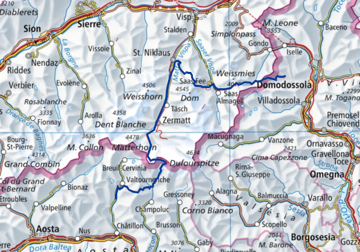
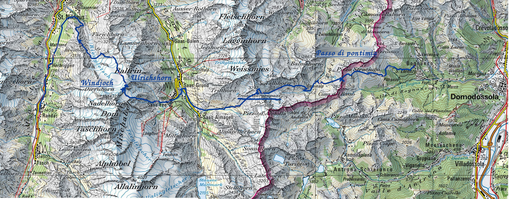

--- 
title: "Отчёт о горном походе 2 к.с.\ Пеннинские Альпы"
author: "Коровин Владимир"
email: "<dimcoker@yandex.ru>"
site: bookdown::bookdown_site
output: 
  bookdown::gitbook:  
    split_by: "section"
    css: [css/style.css, css/fontawesome.min.css]
documentclass: book
link-citations: yes
github-repo: vrkrv/alps19
description: "Отчёт о горном походе"
---

```{r  global_options, echo = FALSE}
knitr::opts_chunk$set(echo = FALSE, message = FALSE,
warning = FALSE)
```

# Справочные сведения

- Горный Турклуб МГУ
- Вид туризма: Горный
- Район: Западные Альпы / Пеннинские Альпы
- Категория сложности: вторая
- Количество участников: 13
- Сроки проведения: 14.07.2019 - 26.07.2019
- Продолжительность: 13 дней
- Протяженность: 119 км
- Набор высоты: 11 км
- Нитка маршрута: ст. Yolki-Palki (Bognanco) -- пер. Passo di Campo (н/к, 2180) -- пер. Passo di Pontimia (1А, 2387) -- пер. Zwischenbergen (1Б, 3287) -- пос. Saas-Almagel -- пер. Windjoch (1Б, 3850, сн-ск) -- вер. Ulrichshorn (1Б, 3925) -- хиж. Bordierhutte -- пер. P2664 (2664, н/к) -- пос. Zermatt -- пер. P3824 (1Б, сн-лд.) -- вер. Breithorn (1Б, 4164, рад.) -- Bivacco Rossi e Volante (3700) -- р. Torrente Curtod -- пер. Сolletto di Nano (1А, 2650) -- пер. Col de Nannaz (1А, 2773) -- вер. Becca Trecare (н/к, 3032) -- Camping Glair -- пос. Grand Moulin -- гор. St.Vincent
- Пройдено перевалов и вершин: 
  - 1Б - 5 шт
  - 1А - 2 шт
- Максимальная высота: 4 164 м (вер. Breithorn)
- Максимальная высота ночевки: 3824 (пер. P3824)

## Список участников

```{r}
library(dplyr)
library(knitr)
library(kableExtra)
library(lubridate)

options(knitr.kable.NA = '')
member_list <- readr::read_tsv("data/member_list.tsv")
knitr::kable(member_list)
```


## Запланированный и пройденный маршрут

```{r}
plan_df <- readxl::read_xlsx("data/plan.xlsx")
kable(plan_df) %>%
  kable_styling(bootstrap_options = "striped", full_width = F)
```

Переезды (дистанция, вырезанная из маршрута):

[*] Использование подъёмника от cт. Furi до cт. Trockener Steg (~7 км)
[**] Переезд от дер. Grand Moullin до гор. Chatillon (~10 км)

Отклонения от маршрута:

1. День 8. Из-за того, что тропа Europaweg к хиж. Europahutte была перекрыта, вынуждены были пройти по нижней тропе, сделав крюк в 2,5 км. В результате мы не успевали в кемпинг Tasch и остановились в кемпинге рядом с ним -- кемпинг Rand.
2. День 12а. Вместо прямого спуска в дер. Nuarsazz был выбран альтернативный маршрут через пер. Col de Fontaines. Оба варианта равноцены по сложности прохождения, посчитали, что интереснее будет пройти через более-менее пустынную местность, чем спускаться через горнолыжный курорт. Также мы совершили на 12 день радиальное восхождение с перевала Col de Nannaz на обзорную вер. Becca Trecare (н/к, 3032), к которой вела тропа с перевала.
3. День 13b. Вместо пешего путешествия по автомобильной дороге к гор. Chatillon прошли только часть маршрута, которая проходила по тропе вдоль дороги до дер. Grand Moullin. От дер. Grand Moullin доехали до гор. Chatillon на автобусе, т.к. тропы после этого места нет, и пришлось бы идти по обочине дороги.

## Схема маршрута

```{r, fig.cap = "Карта района"}

```

```{r, fig.cap = "Первое кольцо"}

```

```{r, fig.cap = "Второе кольцо"}
knitr::include_graphics("photo/maps/map_k2.jpg")
```

## Карта маршрута

```{r}
library(sp)
library(leaflet)

# read track and create annotations:
wp <- readr::read_rds("data/track_extended.Rds")
track_df <- 
  wp %>% 
  as.data.frame %>%
  as.tbl %>%
  mutate_at("time", ymd_hms) %>%
  mutate_at("time", `+`, 7800)

adf <- 
  tribble(
    ~track_seg_point_id, ~text,
    0, "camp. Yolki-Palki",
    186, "passo Groce di Valerio",
    202, "passo di Campo",
    236, "passo di Pontimia",
    429, "Zwischbergenpass",
    542, "camp. Kappelenweg",
    687, "хиж. Mischabelhutte",
    756, "Windjoch",
    770, "Ulrichshorn",
    879, "P2664",
    971, "обход Europaweg",
    1007, "camp. Rand",
    1008, "Zermatt",
    1035, "ст. Trockener Steg",
    1170, "P3824",
    1158, "Breithorn",
    1255, "оз. 2740",
    1382, "col di Nannaz",
    1398, "Becca Trecare",
    1408, "col di Fontaines",
    1462, "camp. Glair",
    1559, "дер. Grand Moulin"
  ) %>%
  inner_join(track_df %>% select(track_seg_point_id, coords.x1, coords.x2, ele, time))

m <-
  leaflet() %>%
  addProviderTiles("OpenTopoMap", group = "OpenTopoMap") %>%
  addLegend(position = 'bottomright',
            opacity = 0.4,
            colors = 'blue',
            labels = 'Пройденный маршрут',
            title = 'Поход 2 к.с. Пеннинские Альпы')

m %>%
  addPolylines(data = Line(wp[wp$day < 9, ]),
               color = 'blue',
               group = 'k1')  %>%
  addPolylines(data = Line(wp[wp$day >= 9, ]),
               color = 'green',
               group = 'k2') %>%
  addMarkers(
    data = adf %>%
      mutate(lab = sprintf("<b>%s<b/><br/>N %s, E %s<br/>elevation: %s<br/>%s",
                           text, round(coords.x2, 4), round(coords.x1, 4), ele, time)),
    lng  = ~coords.x1,
    lat  = ~coords.x2,
    label = ~lapply(lab, htmltools::HTML),
    group = "annotation")
```

## Высотный график

```{r}
library(plotly)

k1_df <- track_df %>% filter(day < 9) %>% mutate_at('dist', `*`, 1.2)
k2_df <- track_df %>% filter(day >= 9) %>% mutate_at('dist', `*`, 1.2)

# add annotations:
adf1 <- 
  adf %>%
  inner_join(k1_df %>% select(track_seg_point_id, day, dist, ele, coords.x1, coords.x2) %>% mutate_at("dist", cumsum)) 

p1 <- 
  k1_df %>%
  mutate_at("dist", cumsum) %>%
  mutate_at("day", sprintf, fmt = "День %s") %>%
  # ggplot(aes(dist, ele, colour = day, label = track_seg_point_id)) +
  ggplot(aes(dist, ele, colour = day, label = time)) +
  geom_line() +
  scale_x_continuous(breaks = seq(0, sum(k1_df$dist), 10)) +
  ggtitle("Первое кольцо")
  # geom_text_repel(aes(label = track_seg_point_id))
plotly::ggplotly(p1) %>%
  add_annotations(x = adf1$dist,
            y = adf1$ele,
            text = adf1$text, 
            xref = "x",
            yref = "y",
            textangle = -60,
            showarrow = TRUE,
            arrowhead = 7)

# second ring:
adf2 <- 
  adf %>% inner_join(k2_df %>% select(track_seg_point_id, day, dist, ele) %>% mutate_at("dist", cumsum)) 

p2 <- 
  k2_df %>%
  mutate_at("dist", cumsum) %>%
  mutate_at("day", sprintf, fmt = "День %s") %>%
  ggplot(aes(dist, ele, colour = day, label = track_seg_point_id)) +
  # ggplot(aes(dist, ele, colour = day, label = time)) +
  scale_x_continuous(breaks = seq(0, sum(k2_df$dist), 10)) +
  geom_line() +
  ggtitle("Второе кольцо")
  # geom_text_repel(aes(label = track_seg_point_id))
plotly::ggplotly(p2) %>%
  add_annotations(x = adf2$dist,
            y = adf2$ele,
            text = adf2$text, 
            xref = "x",
            yref = "y",
            showarrow = TRUE,
            textangle = -60,
            arrowhead = 7) 


```

## География района

Пенинские Альпы расположены в районе Западные Альпы в Европейских Альпах на территории Италии и Швейцарии. Швейцарскую часть также часто называют Альпы Вале (нем. Walliser Alpen), итальнская часть расположена в регионах Пьемонт и Аоста. 

```{r, fig.cap = "Европейские Альпы"}
knitr::include_graphics("photo/maps/01_westalps1.png")
```

```{r, fig.cap = "Западные Альпы"}

```

Район с С ограничен долиной Роны, с Ю -- дол. Аосты, с В -- пер. Симплон, и пер. Grosses Saint Bernard -- c З. Наивысшая точка района -- вер. Dufourspitze 4634 м -- вторая по высоте вершина Альп после Monte Blanche. Район делится на следующие подрайоны (по горным массивам):

- Альпы Grand Combin 
- Альпы Matterhorn
- Альпы Monte Rosa
- Восточные Пеннинские Альпы
- Южные Пеннинские Альпы

Особенностью Пеннинских Альп является наличие большого количество четырёхтысячников, распределенных по  этим меньшим района, что позволяет составлять разнообразные интересные маршруты. Ниже выделены наиболее значимые вершины района:

```{r, fig.cap = "Пенинские Альпы"}

```

## Климат

Туристический сезон в районе начинается в июле и заканчивается серединой сентября. Количество осадков в это время наименьшее, дожди нечасты, температура воздуха на высоте 1500 м -- 20-25 градусов тепла. С середины сентября начинается сезон дождей, в октябре уже идёт первый снег. В Июне также лежит снег, правда, в долинах его может уже и не быть.

В целом, климат напоминает Кавказский, но при этом он более мягкий и погода меняется не так резко, как на Кавказе. В районе климат активно изучается, можно получить довольно точный прогноз на день-два для каждого перевала и вершины, что очень удобно.

В нашем походе у нас был всего два дня дождей, один дождь шёл с вечера до позднего утра, другой -- закончился ночью. Остальные 10 дней были тёплыми и преимущественно солнечными. Самая холодная ночёвка была на снежном плато на пер. P3824, температура ночью опускалась до -5 -- -7 градусов. 

Последние несколько лет в Альпах лето бьёт температурные рекорды, ледники сильно отступают, поэтому рекомендуется следить за погодой за месяц-два до похода. Если температура на четырёх тысячах меньше -5 в Июне -- значит год опять выдался тёплым, и можно брать спальник попроще и полегче. В целом, мужчинам можно ориентироваться на спальник -4, если предвидятся ночёвки на 3500+ на снегу.

Рекомендуемый источник для наблюдения за погодой, с интерактивной картой, на которой можно посмотреть погоду для конкретной точки:

![https://www.meteoblue.com/]

## Логистика

Основными точками "входа" в район являются крупные аэропорты Берна, Турина и Милана. Самые недорогие билеты из Москвы можно купить в Милан -- это 15-20 тыс. рублей с багажом, Турин обойдётся в 20-30 тыс. рублей и примерно также обойдётся Берн. При заброске в Милан важно обращать внимание на аэропорт прибытие, т.к. в Милане целых три международных аэропорта. 

```{r, fig.cap = "Заезд в район"}
knitr::include_graphics("photo/maps/02_pennine2.png")
```

Независимо от выбранной точки заброски, сложностей с заброской в интересующее место возникнуть не должно. Район является популярным туристическим курортом с высокой транспортной доступностью. Практически в любую долину можно добраться общественным транспортом -- автобусом или поездом. В некоторые малонаселённые долины возможно придётся заказывать трансфер, однако стоимость трансфера до крупных железнодрожных узлов / автобусных станций, как правило, достаточно доступная. Прямой трансфер из аэропорта, разумеется, обойдётся в крупную сумму, поэтому следует при планировании выбирать точки-хабы, куда можно доехать для последующей пересадки на общественный транспорт.

В Восточные Пеннинские Альпы имеет смысл заезжать из Милана, добираясь на поезде до гор. Домодоссолы, из которого можно добраться практически в любую точку ЮВ Альп. В Домодоссолу можно заехать и из Берна, но это займёт чуть больше времени.

Если же начало похода расположено в регионе Аоста, имеет смысл лететь в Турин и ехать до дер. Аоста или до ст. Шатильон (Сhatillon). Наконец, Берн предпочтителен для всех заездов с С. 

В нашем походе мы летеле в аэропорт Мальпенса г. Милан, из которого до Домодоссолы ходит прямой автобус. Однако нам не повезло, мы застряли на таможне, потеряли почти два часа в аэропорту и не успели на дневной автобус. Вечером же пришёл микроавтобус с уже забронированными местами, и мы поехали поездом. Поезд был запасным вариантом, но он идёт вместо двух часов -- три, да ещё нужно делать одну пересадку. Оптимальный маршрут поездом подскажут на станции аэропорта, пересадки на разные поезда могут быть на разных платформах.

В Домодоссоле нас дожидался на платформе трансфер до кемпинга. Его мы заказали заранее через кемпинг Yolki-Palki, и звонили из аэропорта предупредить об опоздании. Там же подобрали ещё одного участника похода -- Манюэля Шевролье, который прилетел утренним рейсом из Парижа, и закупил мясо и сыры на месте.

Заканчивали поход мы в регионе Аоста, в Южных Пеннинских Альпах. Станция Chatillon соединена ж/д дорогой с Турином, также ходит много автобусов, в т.ч. до Милана, расписание следует заранее уточнять. Мы случайно попали на автобус до Турина и решили провести полдня в Турине, а вечером переехать в Милан. До Турина ехать примерно 3 часа из Шатильона, дорога комфортная и спокойная. Электрички до Милана ходят каждые час-два, билет действует в течение всего дня, что довольно удобно (но лучше уточнять на кассе). 

## Правила ночлега

В Италии разрешено ночевать в палатках после захода солнца. Это называется "бивуак". Стоять лагерем больше суток ('camping') можно только на высоте 2500+ вне населённых пунктов, заповедников и национальных парков. Однако в районе Аоста для развития туризма с 2019 года приняли региональный закон, который, по сути, запрещает бивуак. Вместо этого для туристов действует развитая сеть хижин и кемпингов. Один из вариантов выброски из Бьелы вместо Шатильона нам пришлось отвергнуть, из-за того что на тропе Alta via, по которой нам пришлось бы идти, запрещено стоять лагерем на всём протяжении тропы.

На практике закон о бивуаке вряд ли соблюдается, т.к. терминология размытая, но мы старались выбирать места ночлегов выше 2000 м, чтобы не вызывать лишних вопросов. Кроме того, почти все зоны ниже 2000 м чаще всего находятся в частной собственности, поэтому здесь приходится искать кемпинги или хижины. 

В Швейцарии закон говорит о том, что можно ночевать всюду выше зоны лесов, избегая частной территории:

```{r, fig.cap = "Памятка ночующим под открытым небом в Швейцарии"}

```

На практике можно стоять даже возле хижин и отелей, но нужно спрашивать разрешения у хозяев. Например, при подготовке маршрута у нас были сомнения, в том, что возле отеля Almagelleralp можно встать лагерем, однако выяснилось, что хозяева не против. В то же время, возле хижины Bordierhutte хозяйка хижины нам в палаточном лагере отказала, но к счастью, мы нашли другое место для ночёвки выше.

## Продукты

В Евросоюзе на год похода действовал карантин на ввоз мясо-молочной продукции из Россией из-за эпидемии свинной африканской чумы. Сублимированные продукты и частично сыр мы брали с собой, но сыры и колбасу у нас была возможность закупить на месте в продуктовых магазинах Домодоссолы. 

В туристических узлах Италии и Швейцарии, таких как Домодоссола, Saas-Fe, Zermatt, Aosta, Chatillon есть сетевые магазины Coop / Donner / Aldi, в которых продаются примерно те же категории товаров, что и в обычных городах. Цены в таких магазинах на 15-20% выше московских. Единственное, что следует отметить, что в Швейцарии очень дорогие местные мясные продукты. 

Кроме магазинов, продукты можно закупать в кемпингах, но ассортимент будет довольно скудным. Наконец, можно попробовать воспользоваться сервисами он-лайн доставки продуктов от амазон и других провайдеров, но эти заказы нужно заказывать заранее за 3-5 дней. Все эти возможности дают большую гибкость при планировании маршрута и возможность вместо забросок устраивать закупки в городках / деревнях.

Газ нам покупали миланские знакомые в Декатлоне, который находится в нескольких остановках электрички от аэропорта Мальпенсы. Правда, товар не очень ходовой, и газа может не оказаться. Поэтому лучше бронировать / закупать газ заранее. В кемпингах, как правило, также можно докупить баллоны любого типа чуть подороже, т.к. они ориентируются на владельцев домов на колёсах. В Zermatt есть туристические магазины, где также можно купить газ.

## Финансы

Важно знать, что в Швейцария не входит в ЕС. Местная валюта -- швейцарские франки, 1 Fr ~ 1$ или 1 Fr = 0.9 Euro. Тем не менее, в Швейцарии принимают Евро, сдачу дают франками. 

Разумеется, это отличный повод для спекуляций в хижинах по обе стороны границы, которые используют "упрощенные" курс. В Швейцаирии курс в хижине будет 1 Fr = 1 Euro , т.е. фактически это комиссия ~10%. Как правило, можно расчитаться картой, но за такие рассчёты может также взыматься комиссия в 1-5% или фиксированная сумма. 

В Италии также можно рассчитаться франками в приграничных хижинах, и курс тогда будет 1 Fr = 0.8 Euro. Поэтому рекомендуется иметь на руках и франки и евро, с возможностью рассчитаться в случае нужды в хижинах за постой. В Zermatt есть банкомат на вокзале, где можно пополнить запас наличных при наличии карты. Также наличные скорее всего понадобятся при рассчётах за транспорт и за услуги в кемпинге (душ, стиральная машина, продукты и т.п.).

Две недели похода нам обошлись в 55 тыс. рублей на человека. 

- 10 000 рублей продукты (включая закупку в Zermatt)
- 19 000 рублей авиабилеты с доп. багажом Москва -- Мальпенса
- 23 000 рублей Кемпинги, переезды, день проживания в Милане и обеды в кафе
- 3 000 страхование жизни (альпинизм, Libery / Согласие / Allianz)

Проживание в городе Милан / Турин обойдётся примерно 5000 руб / день, обед в кафе в Швейцарии -- 30 франков, в Италии -- 20 евро. Также к накладным расходам нужно добавлять шенгенскую визу, если её нет -- 4500 рублей.

Ночлег в кемпинге обойдётся в 5-10 евро с палатки и в 7-10 евро с человека в день. В дол. Saas дополнительно могут быть транспортные сборы в виде обязательного приобретения проездного билета. Ночлег в хижине обойдётся в 60-80 Евро, однако сюда включается обычно пансион. Без пансиона и при упоминании членства ФАР могут быть существенные скидки в половину стоимости "стандартного" проживания. Эту информацию для каждой хижины можно найти отдельно. Бумаги о подтверждении членства никто не требовал. 

Есть некоторые проблемы с покупкой мобильной связи в Италии / Швейцарии. Контракт Vodafone в Италии обойдётся в приличную сумму 50 евро в аэропорту, дешёвые операторы там не представлены. Кроме того, в Швейцарии на звонки будет действовать роуминг, поэтому имеет смысл иметь операторов обеих стран. Можно решить эту проблему покупкой международной сим карты. Мы использовали Водофон, у которого в Швейцарии внезапно кончились деньги из-за роуминга (50 евро, оказалось, не покрывают роуминг), но по счастью, с нами ходил гражданин ЕС, у которого был безлимитный интернет в Швейцарии и мы дозванивались везде по скайпу. В любом случае, этот вопрос лучше решать до похода.

## Полезная информация

- Важно, чтобы в группе был хотя бы один англоговорящий человек
- Немецкий, французский и особенно итальянский будут преимуществом
- Практически везде в горах есть связь, но тарифы в Швейцарии (не ЕС!) и Италии будут разные
- Используйте мобильный интернет и скайп для звонков в кемпинги / хижины
- Обязательно страхуйтесь! Вертолёт прилетит 100%. Эвакуация 1 человека стоит 1200 - 2000 Fr.
- Карты Швейцарии: https://map.geo.admin.ch
- Используйте OpenTopoMap и Waymarked Hiking Trails https://nakarte.me
- Описания вершин / перевалов лучше искать на https://hikr.org
- Для щвейцарских вершин и некоторых перевалов есть https://mountwiki.com
- Расписание автобусов / поездов https://rome2rio.com
- Погода https://www.meteoblue.com/en/weather/week/col-de-valpelline_italy_11074378?day=3

